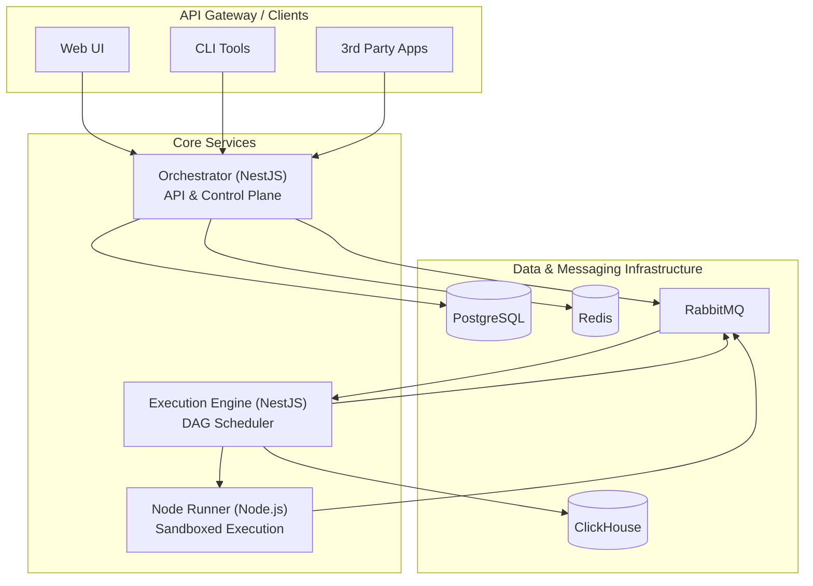

# N8N-Work: Master Implementation Plan (NestJS Unified Stack)

## 1. Executive Summary

N8N-Work is a next-generation, enterprise-grade workflow automation platform designed for scalability, security, and developer experience. It is a clone of n8n, rebuilt from the ground up on a modern microservices architecture featuring a unified **NestJS/TypeScript** stack for both the orchestrator and the execution engine, with a dedicated Node.js service for sandboxed node execution. This document serves as the master plan, consolidating all architectural, technical, and strategic information into a single, coherent guide for building the platform.

The core mission is to provide a platform that supports:
- **Ultra Scale**: Active/active multi-region deployments and elastic autoscaling.
- **Safety & Isolation**: Multi-tiered sandboxing for node execution.
- **Enterprise Governance**: RBAC, PII controls, audit trails, and billing.
- **Developer Velocity**: A first-class developer experience with a powerful SDK, CLI, and a consistent TypeScript-based ecosystem.
- **Observability-First**: Deep, correlated tracing and monitoring across all components.

## 2. Core Principles & Technology Stack

### 2.1. Guiding Principles

- **Domain-Driven Design (DDD)**: Structuring the application around clear business domains.
- **Microservices Architecture**: Ensuring components are independently scalable, deployable, and maintainable.
- **Event-Driven & Asynchronous**: Using message queues for resilient and non-blocking communication.
- **API First**: Defining service contracts clearly, often using NestJS DTOs and OpenAPI.
- **Security by Design**: Integrating security into every layer of the platform.

### 2.2. Technology Stack

| Component                 | Technology                                       | Purpose                                     |
| ------------------------- | ------------------------------------------------ | ------------------------------------------- |
| **Orchestrator (Control Plane)** | NestJS, TypeScript, TypeORM/Prisma             | API, business logic, workflow management    |
| **Engine (Execution Plane)**  | **NestJS, TypeScript**                           | High-performance DAG scheduling & execution |
| **Node Runner (Integration Plane)** | Node.js 18+, Fastify, TypeScript             | Sandboxed node code execution               |
| **Developer SDK**           | TypeScript, Commander.js                         | Custom node development and CLI tools       |
| **Inter-service Comms**     | RabbitMQ / Redis Pub-Sub / gRPC                  | Efficient and reliable internal API calls   |
| **Async Messaging**         | RabbitMQ                                         | Asynchronous task and event queueing        |
| **Primary Database**        | PostgreSQL 15+                                   | Metadata, workflow definitions, state       |
| **Analytics Database**      | ClickHouse                                       | Storing and querying execution logs/metrics |
| **Caching**                 | Redis                                            | Session storage, caching, real-time data    |
| **Object Storage**          | S3 / MinIO                                       | Storage for large binaries and artifacts    |
| **Observability**           | OpenTelemetry, Prometheus, Grafana, Jaeger, Loki | Metrics, tracing, logging, and dashboards   |
| **Containerization**        | Docker, Kubernetes, Helm                         | Deployment, scaling, and orchestration      |
| **Security**                | Vault/KMS, OAuth2, OPA/Cerbos, mTLS (Linkerd/Istio) | Secrets, auth, policy, service mesh       |

## 3. System Architecture

The platform is composed of core microservices that communicate via a message queue and other transporters. The primary backend services are now consistently based on NestJS.



### 3.1. Orchestrator-Nest (Control Plane)

- **Responsibilities**: Manages the full lifecycle of workflows, credentials, executions, users, and tenants. Provides the public REST API, handles authentication, and serves the web UI. It compiles workflows and dispatches execution jobs to the message queue.
- **Key Domains**: `auth`, `workflows`, `credentials`, `executions`, `scheduling`, `webhooks`, `plugin-marketplace`, `audit`.

### 3.2. Engine-Nest (Execution Plane)

- **Responsibilities**: A dedicated NestJS service that consumes execution requests from the queue. It parses the workflow's Directed Acyclic Graph (DAG), determines the execution order, manages state, and dispatches individual step execution requests to the Node Runner.
- **Key Features**: DAG scheduling, state management, retry policies, backpressure handling, and async node lifecycle management.
- **Performance Considerations**: While Node.js is single-threaded, performance will be optimized by leveraging the `worker_threads` module for CPU-intensive tasks (like DAG parsing), using the `cluster` module to scale across CPU cores, and ensuring non-blocking I/O for all operations. NestJS's support for queues and microservices will be fully utilized to build a resilient and scalable engine.

### 3.3. Node-Runner-JS (Integration Plane)

- **Responsibilities**: Executes the code for individual workflow nodes in a secure, sandboxed environment. It receives execution requests from the Engine, runs the node's logic, and returns the result.
- **Isolation Levels**: Supports multiple sandboxing strategies for security: `vm2`, `child_process`, and `MicroVMs (Firecracker)` for untrusted code.

## 4. Data Model & Storage

(This section remains unchanged as the storage strategy is not affected by the compute language change.)

### 4.1. PostgreSQL
The primary relational database for storing core application data.
- **Key Tables**: `users`, `tenants`, `workflows`, `workflow_versions`, `executions`, `credentials`, `audit_logs`.
- **Design**: Data is tenant-isolated. Sensitive data (like credentials) is encrypted at the application layer before being stored.

### 4.2. Redis
Used for high-performance caching and real-time communication.
- **Use Cases**: Session storage, caching of workflow definitions for the engine, rate limiting, and as a broker for WebSocket updates.

### 4.3. RabbitMQ
The message broker for all asynchronous communication.
- **Exchanges & Queues**: Dedicated exchanges for `executions`, `results`, and `events` ensure reliable, decoupled communication between the Orchestrator, Engine, and Runner. Includes dead-letter queues for failed message handling.

### 4.4. ClickHouse
A column-oriented database for analytics.
- **Use Cases**: Storing detailed execution logs and performance metrics for fast querying and dashboarding.

## 5. Key Features & Modules

(This section remains unchanged.)

- **Credentials**: Secure, encrypted storage for API keys, OAuth2 tokens, and other secrets, with multi-tenant isolation.
- **Workflows**: Core logic for creating, defining, versioning, and managing workflows via the UI or API.
- **Executions**: Real-time tracking of all workflow runs, including status, data, and logs.
- **Scheduling**: Trigger workflows based on CRON schedules or fixed intervals with full timezone support.
- **Webhooks**: Dynamically generate secure webhook URLs to trigger workflows from external systems.
- **AI Agents**: A framework for integrating with AI providers (OpenAI, Anthropic) and local models.
- **Real-time Monitoring**: A dedicated module for system health, performance metrics, and custom dashboards.
- **Plugin Marketplace**: A secure system for discovering, installing, and managing custom nodes.
- **Authentication & Authorization**: JWT-based auth, RBAC/ABAC, and multi-tenancy support.
- **Audit Trail**: Immutable logging of all significant actions for compliance and security.

## 6. API & SDK Strategy

(This section remains unchanged.)

### 6.1. REST API

- **Standard**: A versioned (`/api/v1`), well-documented RESTful API for all platform resources.
- **Documentation**: Automatically generated and interactive Swagger/OpenAPI documentation available at `/api-docs`.
- **Authentication**: Secured via JWT Bearer tokens, with support for user-impersonated API keys.
- **Features**: Supports pagination, filtering, sorting, and consistent error handling.

### 6.2. Node SDK (TypeScript)

- **Purpose**: A comprehensive SDK to enable developers to easily create custom nodes.
- **Features**:
    - CLI for scaffolding projects, nodes, and credentials.
    - Base classes for different node types (Action, Trigger).
    - Helper functions for API requests, validation, and data handling.
    - A testing suite for unit and integration tests.

## 7. Development & Deployment (DevOps)

(This section remains unchanged.)

### 7.1. Testing Strategy

A multi-layered testing approach to ensure quality and reliability.
- **Unit Tests (70%)**: Jest-based tests for individual functions and services.
- **Integration Tests (20%)**: Tests that verify interactions between services and a test database.
- **E2E Tests (10%)**: Full workflow execution tests simulating user behavior.
- **Quality Gates**: CI enforces >90% code coverage and requires all tests to pass.

### 7.2. CI/CD Pipeline

- **Automation**: A GitHub Actions workflow automates linting, testing, security scanning, and building on every commit.
- **Deployment**:
    - **Local**: A `docker-compose.yml` file provides a complete, one-command local development environment.
    - **Production**: Helm charts are provided for deploying the entire platform to a Kubernetes cluster. Blue/green or canary deployment strategies are supported.

## 8. Phased Implementation Roadmap

This roadmap is adjusted to reflect the unified NestJS stack.

### Phase 1: Foundation & Core Execution (MVP)
- **Goal**: Establish the core architecture and a successful end-to-end execution path.
- **Deliverables**:
    - Project structure setup for **Orchestrator-Nest** and **Engine-Nest**.
    - Docker-based development environment.
    - Basic Orchestrator API for workflows and credentials.
    - **Engine-Nest** can execute a simple, linear workflow.
    - Runner can execute a basic HTTP request node.
    - Basic JWT authentication and user management.

### Phase 2: Core Features & Usability
- **Goal**: Build out the essential features for creating and managing workflows.
- **Deliverables**:
    - Fully functional Workflow, Execution, and Credentials modules in the Orchestrator.
    - Implementation of Scheduling and Webhook trigger mechanisms.
    - A comprehensive testing suite (Unit, Integration, E2E) for all services.
    - Basic multi-tenancy with data isolation.

### Phase 3: Enterprise-Readiness & Security
- **Goal**: Harden the platform for production and enterprise use.
- **Deliverables**:
    - Full observability stack: distributed tracing, metrics, and structured logging.
    - Advanced security: RBAC/ABAC policies, secrets management with Vault/KMS.
    - High availability and resilience patterns (retries, circuit breakers, DLQs).
    - Complete API documentation and SDK for node development.

### Phase 4: Extensibility & Advanced Capabilities
- **Goal**: Introduce advanced features that differentiate the platform.
- **Deliverables**:
    - AI Agents module.
    - Real-time Monitoring module with custom dashboards.
    - Plugin Marketplace for community and private nodes.
    - Advanced sandboxing with MicroVMs.

### Phase 5: Scale & Optimization
- **Goal**: Prepare the platform for large-scale, multi-region deployment.
- **Deliverables**:
    - Multi-region deployment capabilities with data residency controls.
    - Performance tuning and load testing to meet SLOs.
    - Advanced billing and usage metering systems.
    - Finalized documentation and operational runbooks.

## 9. Detailed Project Structure

This section outlines the proposed directory structure for the entire `n8n-work` monorepo, ensuring consistency and clear separation of concerns across all services and packages.

### 9.1. Monorepo Root Layout

```
n8n-work/
├── orchestrator-nest/          # Control plane service (TypeScript/NestJS)
├── engine-nest/                # Execution engine service (TypeScript/NestJS)
├── node-runner-js/             # Node execution runtime (Node.js)
├── node-sdk-js/                # Public SDK for node developers
├── contracts/                  # Data contracts, DTOs, and schemas
├── infra/                      # Infrastructure & deployment configs (Docker, K8s)
├── docs/                       # Documentation, ADRs, runbooks
├── tests/                      # Cross-service E2E and load tests
├── scripts/                    # Utility scripts and automation
├── docker-compose.yml          # Development environment
├── Makefile                    # Build automation
└── README.md                   # Project overview
```

### 9.2. NestJS Service Structure (Orchestrator & Engine)

Both `orchestrator-nest` and `engine-nest` will follow standard NestJS conventions for scalability and maintainability.

```
service-nest/
├── src/
│   ├── modules/                # Feature modules (e.g., workflows, auth, scheduling)
│   │   └── some-module/
│   │       ├── dto/
│   │       ├── entities/
│   │       ├── guards/
│   │       ├── some-module.controller.ts
│   │       ├── some-module.service.ts
│   │       └── some-module.module.ts
│   ├── common/                 # Shared utilities, decorators, interceptors
│   ├── config/                 # Configuration management (e.g., database.config.ts)
│   ├── infrastructure/         # External integrations (DB, cache, queues)
│   └── main.ts                 # Application entry point
├── test/                       # Unit and integration tests (e.g., some-module.spec.ts)
├── package.json                # Dependencies and scripts
├── tsconfig.json               # TypeScript configuration
├── nest-cli.json               # NestJS CLI configuration
└── Dockerfile                  # Container build file
```

### 9.3. Node-Runner-JS Structure

```
node-runner-js/
├── src/
│   ├── runtime/                # Execution runtime engines
│   ├── security/               # Sandboxing and isolation logic (vm2, child_process)
│   ├── plugins/                # Plugin management
│   ├── nodes/                  # Built-in node implementations
│   └── main.ts                 # Application entry point
├── plugins/                    # Installed plugin storage
├── package.json                # Dependencies and scripts
├── tsconfig.json               # TypeScript configuration
└── Dockerfile                  # Container build file
```

### 9.4. Node-SDK-JS Structure (Public SDK)

```
node-sdk-js/
├── src/
│   ├── cli/                    # Command-line interface for scaffolding
│   ├── types/                  # Core TypeScript type definitions for nodes
│   ├── utils/                  # Utility functions for developers
│   ├── templates/              # Node scaffolding templates
│   └── index.ts                # Main SDK exports
├── examples/                   # Example node implementations
├── package.json                # SDK package definition
└── README.md                   # SDK documentation
```
